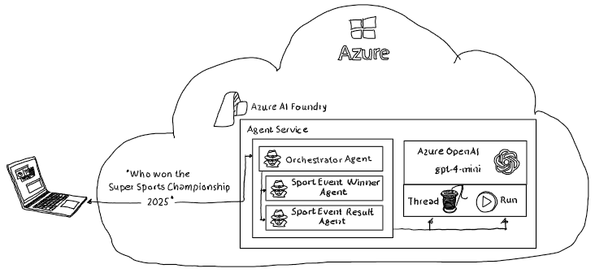
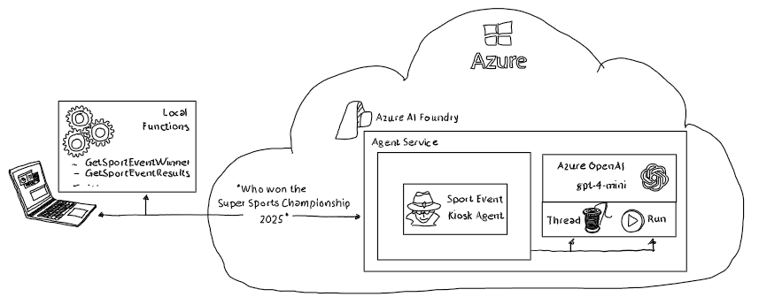

# AzureAI Foundry Agents

[Azure AI Foundry](https://learn.microsoft.com/en-us/azure/ai-foundry/) provides with the [Agent Service](https://learn.microsoft.com/en-us/azure/ai-foundry/agents/overview) a simple and powerfull environment to define, execute  and innovate with AI powered agents. 

Two sample notebooks within this repository highlight how to use the Azure AI Foundry Agent Service for agent-based orchestration and function calling scenarios. 

## Connected Agents

Aagent orchestration scenario involving three distinct agents within Azure AI Foundry. At the center is the **Orchestrator Agent**, whose primary role is to receive user questions and coordinate the process of finding answers. This agent does not answer queries directly; instead, it intelligently delegates sub-tasks to specialized agents based on the nature of the user's request.

Supporting the orchestrator are two specialized agents: the **Sport Event Winner Agent** and the **Sport Event Results Agent**. 

The Winner Agent is responsible for providing information about the winners of sport events, while the Results Agent supplies detailed results for those events. 

When a user asks a question such as "Who won the Super Sports Championship 2025 and what was the result?", the orchestrator agent routes parts of the question to each specialized agent, collects their responses, and then composes a comprehensive answer for the user. 

## Local Functions / Tools

Function calling scenario where a user asks, "Who won the Super Sports Championship?" This event is fictional and does not exist in public records or on the internet, so a large language model (LLM) alone cannot provide an accurate answer. 

In such cases, relying solely on the LLM's training data is insufficient, as the required information is private or domain-specific and not accessible through general knowledge.

To address this, the Azure AI Foundry Agent Service enables the LLM to request local function calling. When the LLM recognizes that it cannot answer the question directly, it triggers a call to a registered local function (tool) that has access to private or protected data sources. 

This functionw retrieve the necessary information—such as the winner or results of the fictional event—and returns it to the agent. 

---

## Repository Structure

| Folder | File | Description |
| ------ | ---- | ----------- |
| [./setup](./setup/) | [setup.azcli](./setup/setup.azcli) | Azure CLI file (PowerShell) to create an Azure AI Foundry project with a deployed gpt-4o-mini LLM instance |
| [./setup](./setup/) | [setup.bicep](./setup/setup.bicep) | bicep file to create all necessary Azure services |
| [./setup](./setup/) | [setup.bicep](./setup/parameters.json) | parameters file to define service names, region etc.
| [./src](./src/) | [LocalToolCallingAgent.ipynb](./src/LocalToolCallingAgent.ipynb) | Notebook with c# code to highlight how to use local functions as tools for hosted agents |
| [./src](./src/) | [ConnectedAgents.ipynb](./src/ConnectedAgents.ipynb) | Notebook with c# code to highlight how to orchestrate multiple specialized agents using a connected/orchestrator agent. |
  
---

## Notes

- The sample agents and tools are for demonstration purposes and use hardcoded responses.
- Extend the local functions or agent prompts to integrate with real data sources as needed.
